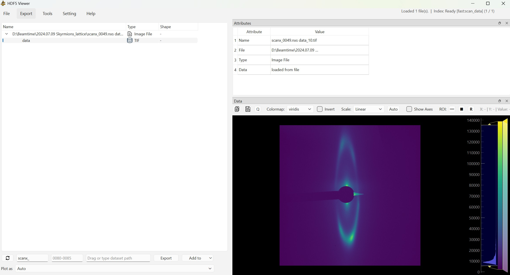

<div align="center">

# HDF5 Viewer — SEXTANTS Edition
A Python HDF5 file viewer with coherent X-ray imaging reconstruction tools

</div>

HDF5 files are developed by the [HDF Group](https://www.hdfgroup.org/solutions/hdf5/).
Each file can contain groups that work like folders and datasets that hold raw data. They
are widely used in industry and academia to store large sets of raw data.

This is an extended fork of [loenard97/hdf5-viewer](https://github.com/loenard97/hdf5-viewer),
tailored for the **Soleil SEXTANTS beamline**. On top of the general-purpose viewer it adds a
suite of scientific analysis and reconstruction tools for coherent X-ray imaging (FTH / HERALDO
and CDI phase retrieval), scattering-data calibration, and multi-dataset comparison.




## 📋 Features

### Viewing & browsing
 - Open, or simply drag & drop, HDF5 files to browse all groups and datasets in a tree view
 - Smart format detection: opens `.h5`, `.hdf5`, `.hdf`, `.nxs`, `.nx5`, `.he5`, `.cxi`, `.mat`
   (MATLAB v7.3+), and even extension-less files by sniffing their contents
   (see [docs/SUPPORTED_FORMATS.md](docs/SUPPORTED_FORMATS.md))
 - Automatic display selection by data type/shape: text, 1-D line plots, multi-curve plots,
   2-D heatmaps, and slice-navigated 3-D images
 - Supports remote files (e.g. on a NAS), filtering datasets by name, and a background-indexed
   dataset search
 - Export datasets to other formats such as `.csv`
   (see [docs/EXPORT_COMPARISON.md](docs/EXPORT_COMPARISON.md))

### Analysis tools (`Tools` menu)
 - **Data Calculator** — interactive arithmetic/FFT on datasets
 - **Data Comparison** — overlay and compare multiple datasets
 - **Scattering Pattern Analyze** — q-calibration and scattering-data analysis
   (X → q conversion) with an FTH-style image layout
 - **FTH Reconstruction** — Fourier-Transform Holography / HERALDO reconstruction
   (CL/CR alignment, beamstop, differential & Gaussian line filters)
 - **CDI Reconstruction** — coherent diffraction imaging phase retrieval
   (ER / HIO / RAAR with optional shrinkwrap; embeds the FTH alignment and filter steps so the
   FTH support can seed the CDI initial guess)
 - **Time Resolved XRMS** — unified X-ray resonant magnetic scattering analysis, with:
   - *Image & Region* — load a frame stack (+ optional reference image with a per-frame
     sum/difference), navigate 3-D frames, pick a rectangle / circle / disk-arc region,
     apply incidence-angle correction, and view live I(r) / I(θ) / I(t) profiles
   - *Curve Fitting* — fit the active profile with a shared model library and polynomial
     background subtraction
   - *Frame Analysis* — fit the chosen model on every frame to track parameters over time

The numerical cores of the reconstruction tools live in [src/recon/](src/recon/), independent of
the GUI, and are covered by unit tests in [tests/](tests/).

Want to add your own tool? The shared tool interface (how a tool plugs into the main window,
receives datasets, and where to put the math) is documented in
[docs/CREATING_TOOLS.md](docs/CREATING_TOOLS.md), with a copy-paste template.


## ▶️ Installation

### Windows
Pre-built executables / installers for this SEXTANTS edition are published on this
repository's [Releases](https://github.com/guozongxia0106-dot/hdf5_viewer_sextants/releases)
page (when available). You can also build your own from source — see *Build an executable* below.

The original general-purpose viewer (without the SEXTANTS analysis tools) has its own builds on
the [upstream Releases](https://github.com/loenard97/hdf5-viewer/releases) page.

### Run from source (any platform)
```commandline
python3 -m venv venv
source venv/bin/activate        # Windows: venv\Scripts\activate
pip install -r requirements.txt
python main.py
```
Python 3.11+ is required.

### Build an executable
A single build script ([build.py](build.py)) covers all packaging modes:

```commandline
python build.py                 # onedir folder build (default, fast startup)
python build.py --onefile       # one self-contained .exe (easy to share)
python build.py --installer     # onedir build + Windows installer (needs Inno Setup 6)
```

The output lands in `dist/`:
 - **onedir** → `dist/HDF5-Viewer/HDF5-Viewer.exe` (with its dependencies)
 - **onefile** → `dist/HDF5-Viewer.exe`
 - **installer** → `dist/HDF5Viewer_Windows_Installer.exe`

The installer step drives [windows/compile.iss](windows/compile.iss) with
[Inno Setup](https://jrsoftware.org/isdl.php); install it first if you want the `.exe` setup.


## 🧪 Development

```commandline
pip install -r requirements_dev.txt
pytest                 # run the test suite (headless Qt)
isort . && black . && flake8 . && mypy .   # formatting & linting
```
Continuous integration runs the test suite on every push/PR
(see [.github/workflows/ci.yaml](.github/workflows/ci.yaml)).


## 🔗 Acknowledgements and Licenses

Based on the original [HDF5 Viewer](https://github.com/loenard97/hdf5-viewer) by Dennis Lönard,
and licensed under the **GNU General Public License v3** (see [LICENSE](LICENSE)).

The following Python libraries are used in this project:
 - [PyQt6](https://riverbankcomputing.com/commercial/pyqt)
 - [h5py](https://docs.h5py.org/en/stable/licenses.html)
 - [numpy](https://numpy.org/doc/stable/license.html)
 - [scipy](https://scipy.org/)
 - [pyqtgraph](https://www.pyqtgraph.org/)
 - [natsort](https://github.com/SethMMorton/natsort)
 - [Pillow](https://pillow.readthedocs.io/)
 - [setuptools](https://github.com/pypa/setuptools)
 - [PyInstaller](https://pyinstaller.org/en/stable/license.html)

All icons are part of the *Core Line - Free* icon-set from [Streamline](https://www.streamlinehq.com/)
and are licensed under a [Link-ware License](https://www.streamlinehq.com/license-freeLinkware).
