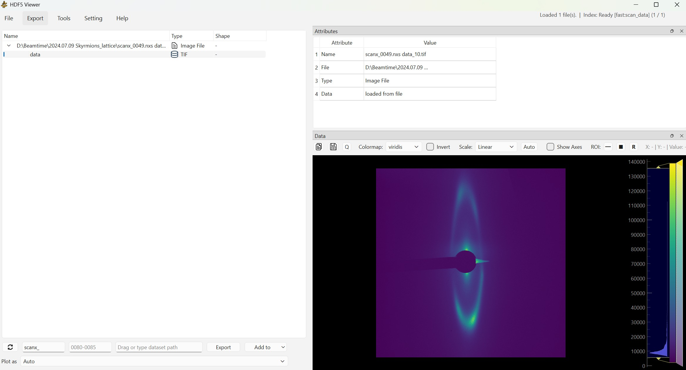

<div align="center">

# HDF5 Viewer — SEXTANTS Edition
A Python HDF5 file viewer with coherent X-ray imaging reconstruction tools

</div>

HDF5 files are developed by the [HDF Group](https://www.hdfgroup.org/solutions/hdf5/).
Each file can contain groups that work like folders and datasets that hold raw data. They
are widely used in industry and academia to store large sets of raw data.

This is an extended fork of [loenard97/hdf5-viewer](https://github.com/loenard97/hdf5-viewer),
tailored for the **Soleil SEXTANTS beamline**. On top of the general-purpose viewer it adds a
suite of scientific analysis and reconstruction tools for coherent X-ray imaging (FTH / HERALDO
and CDI phase retrieval), scattering-data calibration, and multi-dataset comparison.




## 📋 Features

### Viewing & browsing
 - Open, or simply drag & drop, HDF5 files to browse all groups and datasets in a tree view
 - Smart format detection: opens `.h5`, `.hdf5`, `.hdf`, `.nxs`, `.nx5`, `.he5`, `.cxi`, `.mat`
   (MATLAB v7.3+), and even extension-less files by sniffing their contents
   (see [docs/SUPPORTED_FORMATS.md](docs/SUPPORTED_FORMATS.md))
 - Automatic display selection by data type/shape: text, 1-D line plots, multi-curve plots,
   2-D heatmaps, and slice-navigated 3-D images
 - Supports remote files (e.g. on a NAS), filtering datasets by name, and a background-indexed
   dataset search
 - Batch controls at the bottom left address many scans at once: a file prefix, a scan range
   (`0080-0085` or `0080,0085,0027`) and one or more dataset paths. Press **Enter** in any of
   the three fields to preview the first matched scan; drag several datasets from the tree in
   one go to export several Y columns per scan. The dialog has an **Export** page and a
   **Plot** page over the same selection — see [Plot](#-plot)
 - Saving and exporting are described under
   [Saving & exporting](#-saving--exporting) below; drawing the same numbers as a
   publication figure is under [Plot](#-plot)

### Analysis tools (`Tools` menu)
 - **Data Calculator** — arithmetic and FFT over two datasets, either from the preset buttons
   or from a typed formula (`(A - B) / A`, `y / max(y)`, `np.abs(A)`). Formulas run through a
   whitelisting evaluator, so only maths reaches the interpreter
 - **Data Comparison** — overlay and compare multiple 1-D datasets. Each curve carries its own
   **Curve Transform**: `f(Y)` and `f(X)` formula columns replace fixed offset/scale fields, so
   a curve can be normalised (`y / max(y)`), differentiated (`gradient(y, x)`), background
   subtracted (`y - mean(y[:20])`) or rescaled, per row. A bad formula turns its cell red and
   the curve falls back to its raw values instead of breaking the plot
 - **Scattering Pattern Analyze** — q-calibration and scattering-data analysis
   (X → q conversion) with an FTH-style image layout; the `to q` / `to pixel` axis switch sits
   in the *Q Geometry* box next to the energy, pixel size and distance it is computed from
 - **FTH Reconstruction** — Fourier-Transform Holography / HERALDO reconstruction
   (CL/CR alignment, beamstop, differential & Gaussian line filters, and interactive
   free-space propagation focus using the photon energy and detector geometry)
 - **CDI Reconstruction** — coherent diffraction imaging phase retrieval
   (ER / HIO / RAAR with optional shrinkwrap; embeds the FTH alignment and filter steps so the
   FTH support can seed the CDI initial guess)

   Both reconstruction tools end on a *Save & Export* box: pick a `Target`
   (Real / Imag. / Phase / Abs. / **Full**), then `Copy` or `Export`. With `Full`, `Copy`
   puts the four panels on the clipboard as one composite picture and `Export` writes one
   file per component.
 - **Time Resolved XRMS** — unified X-ray resonant magnetic scattering analysis, with:
   - *Image & Region* — load a frame stack (+ optional reference image with a per-frame
     sum/difference), navigate 3-D frames, pick a rectangle / circle / disk-arc region,
     apply incidence-angle correction, and view live I(r) / I(θ) / I(t) profiles
   - *Curve Fitting* — fit the active profile with a shared model library and polynomial
     background subtraction
   - *Frame Analysis* — fit the chosen model on every frame to track parameters over time

The numerical cores of the reconstruction tools live in [src/recon/](src/recon/), independent of
the GUI, and are covered by unit tests in [tests/](tests/).

Want to add your own tool? The shared tool interface (how a tool plugs into the main window,
receives datasets, and where to put the math) is documented in
[docs/CREATING_TOOLS.md](docs/CREATING_TOOLS.md), with a copy-paste template.


## 💾 Saving & exporting

Every save in the application is one of two kinds:

| | What it does | How it looks |
|---|---|---|
| **Quick** | Writes exactly what is on screen, through a single save-path dialog | An **icon** in a viewer toolbar, or `Export` in the tree's right-click menu |
| **Full** | Opens a settings dialog first (columns, X axis, dialect, colormap…) | A text button labelled **`Export`**, and the `Export/Plot` menu-bar entry |

"What is on screen" is defined precisely: the `f(X)` / `f(Y)` transforms and the X → q
conversion **are** part of the exported values; `Log X` / `Log Y` are **not** — they are axis
rendering, so the numbers written stay linear. For images, the active colormap, inversion,
contrast levels and incidence correction are baked into the exported picture.

A curve with no X dataset attached is written as a bare `Y` column — no index column is
invented.

The tree's right-click menu is `Export` · `Plot` · `Set X`. The first two show the dataset
first and then act on what is displayed, so they always agree with what you see.

**`Set X`** picks the X axis without dragging. It goes to whichever X-capable window you were
last in — an open Plot window, export dialog or the Comparison tool takes it directly (the
Comparison tool re-bases every row of matching length, as its own `Set X` button does); with
none open it goes to the displayed curve. Either way the choice is remembered and pre-fills the X field of export
dialogs opened afterwards. A length mismatch only skips the immediate apply — the choice is
kept, since the next scan may well fit.

### Text formats and Excel

Excel decides how to split columns from the machine's regional *list separator*, not from the
file. A comma file therefore opens as a single column on a French or German Windows, and its
`1.5` values are not even recognised as numbers there. Rather than guess, the format is an
explicit choice, the way R separates `write.csv` from `write.csv2`:

| Dialect | Separator | Decimal | Use for |
|---|---|---|---|
| **TXT** (default) | tab | `.` | anything — a tab cannot collide with a decimal mark |
| **CSV** | `,` | `.` | en/US Excel, pandas, numpy |
| **CSV2** | `;` | `,` | fr/de/es/it Excel |

The choice is remembered and shared by the quick and full paths.


## 📈 Plot

`Plot` draws the same numbers `Export` would write, as a matplotlib figure — for a
publication-ready picture without a round trip through another program. There is one kind of
Plot window: a **Data** page with the table and a **Plot** page with the figure, opened from

- the 📈 icon beside `Copy` and `Save` in a curve viewer,
- the `Plot` button beside `Export` in the Comparison and Calculator tools,
- `Export/Plot ▸ Plot` (`Ctrl+Shift+P`) and the tree's right-click `Plot`,
- the batch dialog's **Plot** page, which overlays every matched scan in one figure.

The batch dialog is one selection seen two ways: an `Export` page showing the table, and a
`Plot` page holding a **live figure** of that same table — the page is the preview, not a
button that opens one. Each page is only its preview; everything that says where the batch goes
sits in one `Batch` box below them — the scans, the X axis, the output folder, and an
`Output`/`Format` pair that follows whichever page is in front. The `OK` button is labelled
with that page too. Both pages read the same table, so the figure can never hold curves the
export would not write.

| | Export | Plot |
|---|---|---|
| **Output** | `Single files` (one per scan) · `Combined file` | `Figure per scan` · `Figure combined` (default) |
| **Format** | `TXT` · `CSV` · `CSV2` | `PNG` · `JPG` |

Both write into the same folder: one produces tables, the other images. Overlaying is the
default because comparing scans is what a batch plot is for. The images are rendered by the
panel on screen, so they carry the palette, log axes and labels you set there — the preview is
the specification. `PNG` is the default because a plot is line art, which is what JPG's block
transform handles worst.

The figure has a title and axis labels, per-axis log switches, grid, a legend, and
matplotlib's pan/zoom toolbar. `Lines` and `Markers` pick the mark — line, scatter, or a
marked line; switching off the last one turns the other back on, since neither would draw an
empty figure. `Copy` puts it on the clipboard; `Save Figure` writes PNG, PDF
or SVG.

**`Lock`** keeps the Plot settings box — title, axis labels, palette and the switches — for
every Plot window opened afterwards, so a run of scans comes out looking the same instead of
each one deriving its own defaults. Nothing outside that box is locked: every figure still
autoscales to its own data. Unchecking releases it back to per-plot defaults, and a locked log
axis is not forced onto data that cannot take it.

The Calculator's `Plot` is the one exception to the single-axis rule: the operands go on the
left Y and the result on a second Y axis to the right, because a ratio or an FFT shares no
scale with the raw counts it came from and would otherwise flatten into the baseline. The
right axis is tinted to its own curve so the two scales cannot be confused, one legend covers
both, and a log switch applies to both at once. With no operands to compare against, it stays
a single-axis plot.

A log switch is disabled when that axis contains values ≤ 0, since a log scale would silently
drop those points — the two axes are gated separately, so a field sweep through zero keeps its
log Y.

Curves that arrived plotted against the sample index can be re-based without reopening
anything: drag a dataset from the tree onto the window's **`X data`** field (or type
`file::path`). Only curves of a matching length are re-based — a shorter one keeps its own X
rather than being trimmed into a wrong pairing — and `Reset X` undoes it.

### Colours

Curves take their colours from a qualitative palette in fixed slot order, never from a
continuous colormap sampled N times. The default is **Set1**, and all of matplotlib's
qualitative sets are available (`tab10`, `tab20`, `tab20b`, `tab20c`, `Paired`, `Accent`,
`Dark2`, `Set2`, `Set3`, `Pastel1`, `Pastel2`) plus **Okabe-Ito**. Past the end of a palette
the hues repeat with a new line style rather than inventing a colour.

Each entry's tooltip carries a *measured* number: the worst OKLab ΔE between adjacent slots
under simulated protanopia/deutanopia. It is worth reading before publishing — several popular
palettes score low (Set1 5.9, tab10 0.7, Set2/Set3 1.5), meaning two neighbouring curves can
look alike to a colour-blind reader. Okabe-Ito (15.8) and `Paired` (11.5) are the safe choices.


## ▶️ Installation

### Windows
Pre-built executables / installers for this SEXTANTS edition are published on this
repository's [Releases](https://github.com/Zongxia-GUO/hdf5_viewer_sextants/releases)
page (when available). You can also build your own from source — see *Build an executable* below.

The original general-purpose viewer (without the SEXTANTS analysis tools) has its own builds on
the [upstream Releases](https://github.com/loenard97/hdf5-viewer/releases) page.

### Run from source (any platform)
```commandline
python3 -m venv venv
source venv/bin/activate        # Windows: venv\Scripts\activate
pip install -r requirements.txt
python main.py
```
Python 3.11+ is required.

### Build an executable
A single build script ([build.py](build.py)) covers all packaging modes:

```commandline
python build.py                 # onedir folder build (default, fast startup)
python build.py --onefile       # one self-contained .exe (easy to share)
python build.py --installer     # onedir build + Windows installer (needs Inno Setup 6)
```

The output lands in `dist/`:
 - **onedir** → `dist/HDF5-Viewer/HDF5-Viewer.exe` (with its dependencies)
 - **onefile** → `dist/HDF5-Viewer.exe`
 - **installer** → `dist/HDF5Viewer_Windows_Installer.exe`

The installer step drives [windows/compile.iss](windows/compile.iss) with
[Inno Setup](https://jrsoftware.org/isdl.php); install it first if you want the `.exe` setup.


## 🧪 Development

```commandline
pip install -r requirements_dev.txt
pytest                 # run the test suite (headless Qt)
flake8 .               # must report 0 - this is a CI gate
mypy src main.py       # advisory: the annotation backlog is still large
```

Continuous integration runs the test suite (Python 3.11 and 3.12) and flake8 as
**hard gates** on every push/PR; mypy runs advisory
(see [.github/workflows/ci.yaml](.github/workflows/ci.yaml)).

Note on formatting: do **not** run `black .` over the tree. The reconstruction
tools align assignments into columns on purpose, and black would collapse every
one of them into an unreviewable diff. The flake8 policy in
[setup.cfg](setup.cfg) documents which checks are waived for that reason.


## 🔗 Acknowledgements and Licenses

Based on the original [HDF5 Viewer](https://github.com/loenard97/hdf5-viewer) by Dennis Lönard,
and licensed under the **GNU General Public License v3** (see [LICENSE](LICENSE)).

The following Python libraries are used in this project:
 - [PyQt6](https://riverbankcomputing.com/commercial/pyqt)
 - [h5py](https://docs.h5py.org/en/stable/licenses.html)
 - [numpy](https://numpy.org/doc/stable/license.html)
 - [scipy](https://scipy.org/)
 - [pyqtgraph](https://www.pyqtgraph.org/)
 - [natsort](https://github.com/SethMMorton/natsort)
 - [Pillow](https://pillow.readthedocs.io/)
 - [setuptools](https://github.com/pypa/setuptools)
 - [PyInstaller](https://pyinstaller.org/en/stable/license.html)

All icons are part of the *Core Line - Free* icon-set from [Streamline](https://www.streamlinehq.com/)
and are licensed under a [Link-ware License](https://www.streamlinehq.com/license-freeLinkware).
